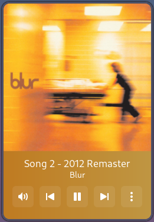

# RSTROLLER

MPRIS controller, with GUI and Waybar integrations.

_wrote in rust btw._

## Vendored Dependencies

This project includes a modified version of [mpris-rs](https://github.com/Mange/mpris-rs) in `vendor/mpris-rs/`, licensed under Apache 2.0.

## License

This project is licensed under the [Apache 2.0 license](./LICENSE).
